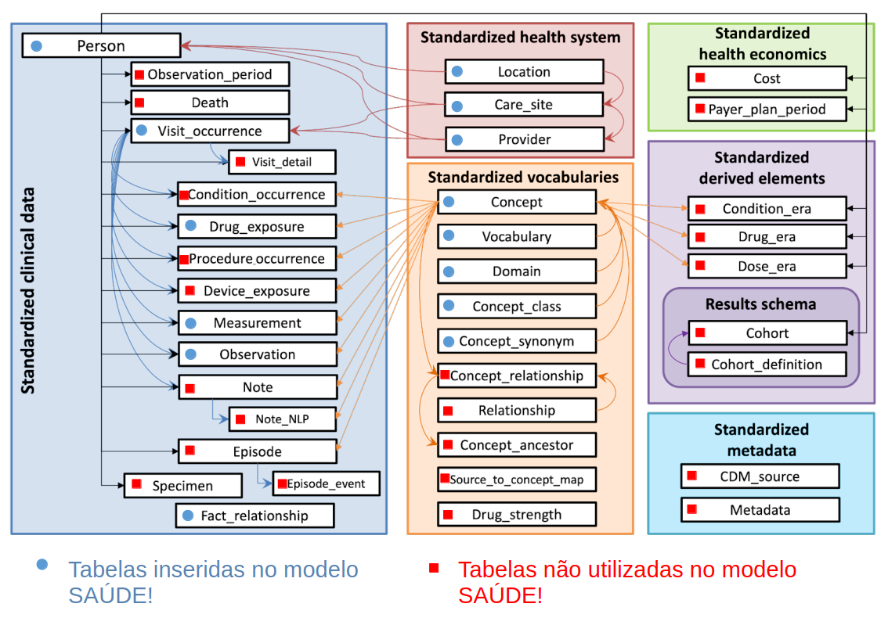
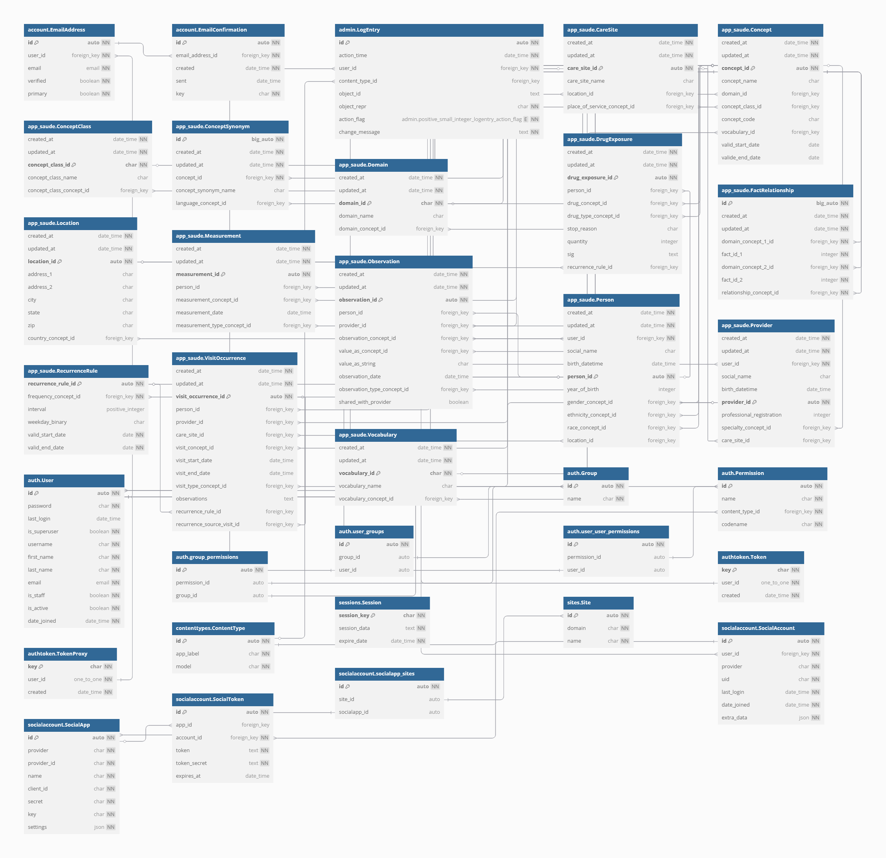
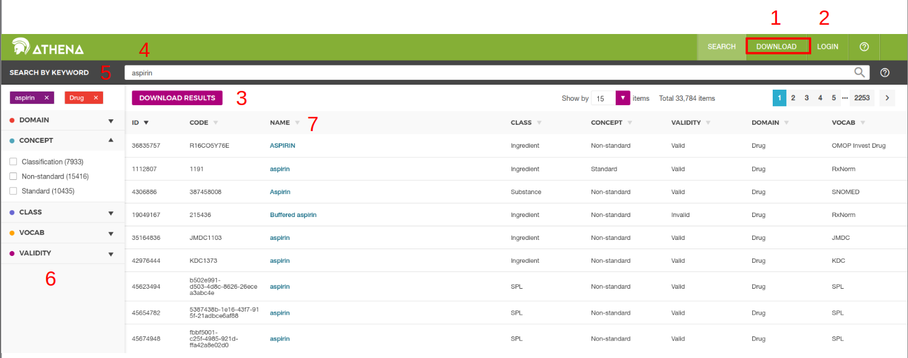
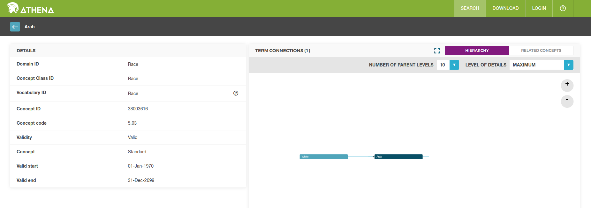

# Modelo do banco de dados para o aplicativo SAÚDE! baseado no OMOP CDM

## 1 Introdução

Neste arquivo será apresentada uma brevíssima introdução ao OMOP CDM, bem como as decisões tomadas pelo grupo de desenvolvimento do aplicativo SAÚDE! sobre as tabelas e campos utilizados no projeto. Por fim, divergências quanto a tabelas e conceitos (vocabulários) que não se encontram no modelo padrão do OMOP CDM serão explicitadas e as razões para tais modificações serão consideradas. Acreditamos que dessa forma, pesquisadores que tenham em mãos os dados armazenados ao longo do projeto possam facilmente transformar esses dados totalmente no padrão OMOP CDM desejado.

O principal objetivo do projeto OMOP CDM é desenvolver um modelo (e vocabulários) para que a comunidade que trabalhe com prontuários médicos possam utilizar como ponto comum na sua pesquisa. Dessa forma, é bastante voltado para o processo de transformação de bancos com modelos distintos para o modelo "padrão" disponibilizado pela entidade responsável pelo mesmo. No projeto SAÚDE! a ideia é utilizar o modelo mais alinhado possível ao padrão, tornando o processo de transformação bem mais simples.

### 1.1 Termos recorrentes

Alguns termos recorrentes para contextualizar o projeto que nosso modelo de banco é baseado:

Observational Medical Outcomes Partnership (OMOP) ⇒ "a public-private consortium based in the United States of America, created with the goal of improving the state of observational health data for better drug development, which started in response to the U.S. Food and Drug Administration (FDA) Amendments Act of 2007"

Common Data Model (CDM) ⇒ "OMOP developed a CDM, standardizing the way observational data is represented. After OMOP ended, this standard started being maintained and updated by OHDSI"

Observational Health Data Sciences and Informatics (OHDSI) ⇒ "is an international collaborative effort aimed at improving health outcomes through large-scale analytics of health data ..."

— [Wikipedia](https://en.wikipedia.org/wiki/Observational_Health_Data_Sciences_and_Informatics)

"EMR (Electronic Medical Record) : É um registro digital das informações médicas de um paciente criado e mantido por um único provedor de assistência médica ou clínica. Contém informações médicas como histórico médico, diagnósticos, medicações prescritas, resultados de testes laboratoriais, etc., relevantes para o tratamento do paciente dentro de uma única organização médica. O acesso ao EMR é geralmente restrito a profissionais de saúde que trabalham dentro da mesma instituição médica onde o EMR é mantido."

"EHR (Electronic Health Record): É um registro digital das informações de saúde de um paciente que é compartilhado entre múltiplos provedores e organizações de saúde. Além das informações encontradas em um EMR, um EHR pode conter informações mais amplas, como registros de saúde do paciente ao longo do tempo, resultados de exames de diferentes instituições médicas, registros de internações hospitalares, registros de tratamentos, etc.
O EHR é projetado para ser acessível por vários prestadores de cuidados de saúde em diferentes locais, proporcionando uma visão mais abrangente e integrada da saúde de um paciente."

— [EMR vs. EHR](https://anestesiagaap.com.br/emr-vs-ehr/)

"Observational databases differ in both purpose and design. EMR are aimed at supporting clinical practice at the point of care, while administrative claims data are built for the insurance reimbursement processes. Each has been collected for a different purpose, resulting in different logical organizations and physical formats, and the terminologies used to describe the medicinal products and clinical conditions vary from source to source. The CDM can accommodate both administrative claims and EHR ..."

— [Why do we need a CDM?](https://www.ohdsi.org/data-standardization/)

### 1.2 Versões utilizadas

O projeto foi desenvolvido considerando para alinhamento do banco de dados a versão 5.4 do modelo OMOP CDM. A escolha foi considerando que era a versão estável na época de início do projeto:

"As of April 2025, the most recent CDM is at version 6.0, while version 5.4 is the stable version used by most tools in the OMOP ecosystem."  
— [Wikipedia](https://en.wikipedia.org/wiki/Observational_Health_Data_Sciences_and_Informatics)

Em relação aos conceitos (ou *concepts*), uma das partes centrais do modelo, foram baixados todos os vocabulários disponíveis na plataforma ATHENA no mês de maio. Como a proposta do projeto se expande para além de um prontuário médico, conceitos novos foram adicionados para alcançar nosso objetivo. Tais conceitos, domínios, classes e vocabulários foram adicionados nos arquivos da pasta app_saude/commands/. O nome dos arquivos é seed_, sendo realizada uma divisão de áreas para facilitar as buscas. Uma descrição mais detalhada sobre os conceitos escolhidos pode ser encontrada na seção Vocabulário deste documento. 

### 1.3 Links importantes

A seguir serão apresentados fontes importantes de informação criadas pela comunidade que desenvolve o OMOP CDM. Tais arquivos podem ser utilizados para sanar dúvidas que o presente arquivo não consiga resolver.

- [Tabelas modelo 5.4](https://ohdsi.github.io/CommonDataModel/cdm54.html#person) - principal fonte do modelo utilizado
- [Themis](https://ohdsi.github.io/Themis/index.html) - convenções de como popular as tabelas
- [Athena](https://athena.ohdsi.org/search-terms/start) - vocabulários existentes
- [The Book of OHDSI](https://ohdsi.github.io/TheBookOfOhdsi/index.html#license) - livro do OHDSI explicando o modelo de forma didática
- [Forums OHDSI](https://forums.ohdsi.org) - fórum com discussões sobre o OHDSI
- [GitHub OHDSI](https://github.com/OHDSI)
- [Site OHDSI](https://www.ohdsi.org/data-standardization)
- [FAQ CMD](https://ohdsi.github.io/CommonDataModel/faq.html)
- [OMOP CDM ERD](https://ohdsi.github.io/CommonDataModel/cdm54erd.html) - esquema relacional da versão 5.4
- [Esquema OMOP CDM](https://omop-erd.surge.sh/omop_cdm/index.html) - esquema visual do modelo (pode ser mais lento)

### 1.4 FAQ

O [*frequently asked questions*](https://ohdsi.github.io/CommonDataModel/faq.html) disponibilizado pelo OHDSI é uma boa fonte para tirar dúvidas pontuais mas é extenso e um pouco díficil de compreender para pessoas sem conhecimento prévio na área. Entretanto, algumas perguntas foram importantes para o grupo entender melhor o modelo:

- 2. How does my data get transformed into the common data model?
- 3. Are any tables or fields optional?
- 6. How are gender, race, and ethnicity captured in the model? Are they coded using values a human reader can understand?
- 7. Are there conditions/procedures/drugs or other domains that should be masked or hidden in the CDM?
- 8. How is time-varying patient information such as location of residence addressed in the model?
- 9. How does the model denote the time period during which a Person’s information is valid?
- 11. What if I have EHR data? How would I create observation periods?
- 12. Do I have to map my source codes to Standard Concepts myself? Are there vocabulary mappings that already exist for me to leverage?
- 16. What if I have source codes that are specific to my site? How would these be mapped?

## 2 Descrição do OMOP CDM

No [site](https://ohdsi.github.io/CommonDataModel/) do OHDSI é disponibilizado uma representação visual de todo o modelo 5.4, com as suas 39 tabelas subdivididas em 6 categorias. A figura abaixo adiciona a tal representação visual círculos (ou quadrados) para indicar se a respectiva tabela foi utilizada no banco de dados do projeto SAÚDE!. Os círculos de cor azul indicam que a tabela foi adicionada ao modelo enquanto o quadrado de cor vermelha indica que a tabela não está sendo utilizada pelo banco. Mais detalhes quanto ao modelo completo utilizado no projeto (como tabelas e campos não existentes no OMOP CDM) podem ser encontrados na seção 4 desse documento.

### 2.1 Tabelas disponíveis

A seguir será apresentado uma breve descrição de cada uma das tabelas. Mais importante, será discutido a escolha de adicionar (ou não) cada uma das tabelas no modelo do projeto. Novamente reforçamos que para maiores detalhes da referência oficial do modelo OMOP CDM é recomendado consultar [Tabelas modelo 5.4](https://ohdsi.github.io/CommonDataModel/cdm54.html#person).

#### 2.1.1 Standardized clinical data

São as tabelas principais em que os dados do paciente são inseridos. A ideia é ser um conjunto de tabelas no qual qualquer informação do paciente possa ser adicionada, desde de um procedimento cirúrgico, uma consulta, uma medida (peso, altura, IMC), até observações mais gerais.

**person** Tabela que identifica todas as pessoas usuárias do sistema como pacientes. Guarda informações como endereço (uma chave estrangeira para uma entrada da tabela location), do sexo de nascimento, data de nascimento e raça/etnia. No padrão teria uma entrada para provider e care_site, mas como a ideia é que o paciente possa ter mais de um provider vinculado a ele, foram removidos esses campos.

**death** Tabela para descrever a morte de um paciente, caso essa informação seja fornecida. Dados como data e motivo da morte são inseridos. Como o aplicativo não trata desses aspectos do paciente, tabela não utilizada.

**visit_occurrence** Indica quando o paciente tem uma interação com o sistema de saúde. Pode ser tanto ao dar entrada em um hospital para exames de rotina, uma consulta, ou mesmo casos mais graves como ser internado em uma UTI. Pode ser utilizado também para descrever encontros fora do ambiente de saúde, como um atendimento de um ACS na casa do paciente. Recebe dados do paciente, do profissional de saúde que realizou o atendimento, a data de início e fim, o local que ocorreu e o tipo de atendimento realizado. Inserido no modelo SAÙDE!.

**visit_detail** Utilizada para detalhar mais entradas da visit_ocurrence. Pode existir mais de uma por visit_ocurrence. Não utilizada no modelo.

**condition_occurrence** Utilizada para guardar eventos que indiquem a presença de uma doença ou utilização de medicação por parte do paciente. Pode ser reportada tanto pelo paciente como pelo profissional de saúde. Não utilizado.

**drug_exposure** Utilizada para armazenar dados relacionados a ingestão de medicamentos pelo paciente. É uma tabela com muitos campos, que deve armazenar o paciente, a droga utilizada, tempo de uso, profissional que indicou o uso entre outros. A ideia inicial do aplicativo era tratar também de medicamentos utilizados pelo paciente, logo a tabela foi incluída. Mas como o foco da primeira versão foi no diário, tal tabela não está sendo usada diretamente, mas pode ser populada facilmente em novas versões.

**procedure_occurrence** Armazena procedimento realizados por um profissional de saúde em um paciente com o objetivo de diagnosticar uma doença ou para fins terapêuticos. Exames laboriatórios não devem ser incluídos nesta tabela. Medir a pressão (também conhecido como flebotomia), é uma ação tão simples que geralmente não é inserida nessa tabela. Não utilizada.

**device_exposure** Utilizado para armazenar objetos físico utilizados no paciente com finalidade de diagnosticar uma doença ou para seu tratamento. Seu leque é amplo, indo de objetos simples como bandeide e seringas até mais complexos como o desfibrilador e o marcapasso. Pelo escopo do projeto, não foi adicionado a tabela ao modelo.

**measurement** Armazena resultados de medidas do paciente, sendo comum para testes laboratoriais. Pode ter um valor numérico (com unidade) ou ser categórico, com um conceito associado. Foi utilizado apenas para armazenar dados iniciais fornecidos pelo paciente, como sua altura e peso.

**observation** A principal tabela para a primeira versão do aplicativo SAÚDE!. É utilizada para armazenar dados clínicos registrados a partir de exames, questionários ou exames e que não se enquadrem em outras tabelas. Como a principal funcionalidade do aplicativo é ser um diário em que o paciente armazena suas informações, seria uma espécie de questionário. Logo, todos os seus dados acabam sendo inseridos como entradas dessa tabela. Existem alguns abusos do modelo de como essa tabela é populada, e foram realizados de maneira consciente por parte dos desenvolvedores. O primeiro é em relação aos dados que são armazenados arqui. Como o diário (e consequentemente essa tabela) registra tanto texto livre como interesses inseridos pelo paciente, pode ocorrer que ele adicione medidas que se encaixariam em outra tabela, como measurement, aqui. Uma outra divergência é que estamos usando um único conceito para diferentes (áreas de) interesses, e a diferenciação é dada pelos seus valores no campo value_as_string como json (que sofreu um desvio de função e pode ter mais de 60 caracteres, diferentemente do padrão OMOP CDM). Tais escolhas foram feitas para simplificar a implementação do sistema, uma vez que não conhecemos a priori o tipo de dado que será inserido pelo usuário. Também não consideramos uma boa prática adicionar novos conceitos com ids arbitrários todas as vezes que o usuário adicione novas áreas de interesse ou perguntas. Dessa forma, eliminiamos um problema e adicionamos outro a médio-longo prazo, o de análise de dados. Em um futuro seria interessante definir alguma regra para transformar esses dados cadastrados na forma de observations em entradas de outras tabelas ou mesmo mapear os conceitos utilizados para valores fornecidos no vocabulário padrão (pelo menos para as perguntas que já estão cadastradas).

**note** Armazena dados escritos por um profissional da saúde sobre um paciente no formato de texto livre. Não utilizada.

**note_nlp** Usado em conjunto com a tabela note. Armazena termos importantes de uma entrada de note que foram conseguidos partindo de ferramentas de processamento de linguagem natural. Não utilizada.

**episode**  Utilizado para agregar dados de várias tabelas em um evento único (como o tratamento de um câncer). As tabelas que podem entrar em um episódio são visit_occurence, drug_exposure, procedure_occurrence, device_exposure. Não utilizada.

**episode_event** Utilizada para conectar eventos clínicos, como os armazenados nas tabelas condition_occurrence, drug_exposure, procedure_occurrence, measurement, em episódios. Não utilizada.

**specimen** Armazena informações de amostras biológicas de um paciente. Não utilizada.

**fact_relationship** Utilizada para armazenar relações entre dados que podem (ou não estar em mais de uma tabela). Por exemplo, para relacionar dois pacientes, numa relação de pai para filho. A boa prática recomenda que sejam armazenadas duas relações (A é pai de B e B é filho de A), mas para os conceitos utilizados usamos em geral apenas unidirecional. Aqui armazenamos relações importantes, como a conexão entre paciente e profissional de saúde. Foi necessário mover tal relação para essa tabela porque na versão padrão do OMOP CDM cada paciente tem um único profissional associado, o que é incompátivel com a finalidade do projeto.

#### 2.1.2 Standardized health system

São tabelas que fornecem informações sobre as fontes prestadoras de serviço de saúde, além de locais em que esses serviços ocorrem. Também podem ser usadas para descrever lugares de uma pessoa. Todas foram utilizadas no projeto SAÚDE!.

**location** Basicamente descreve os endereços físicos de pessoas e unidades de saúde de atendimento (e talvez de eventos). Uma interface bastante genérica e importante para o projeto. Tem apenas um campo obrigatório, o location_id. Uma questão importante é como utilizar seus campos, uma vez que ele é bastante centrado nos EUA, como a citação abaixo indica. 

"The current iteration of the LOCATION table is US centric. Until a major release to correct this, certain fields can be used to represent different international values.

- STATE can also be used for province or district

- ZIP is also the postal code or postcode

- COUNTY can also be used to represent region"

— [Tabelas modelo 5.4](https://ohdsi.github.io/CommonDataModel/cdm54.html#location)

**care_site** Utilizado para delimitar a unidade de atendimento, utilizando uma chave estrangeira para a localização da mesma. Necessário para associar o local de trabalho de um agente de saúde. place_of_service_concept_id é para identificar a principal atividade exercida dentro da unidade de atendimento. Um vocabulário simples, mas talvez útil para a primeira etapa do modelo seria o Visit (com 20 opções).

**provider** Utilizada para descrever cada um dos agentes de saúde que farão atendimento/acompanhamento dos pacientes. Existe um número grande de campos importantes para se discutir dentro da esfera do Provider, alguns dos principais são specialty_concept_id, care_site_id e gender_concept_id. O specialty_concept_id pode ser usado dentro de um vocabulário pequeno inicialmente já escolhido (mas não implementado). Cada Provider pode ter associado um único care_site_id (o seu principal ou que ele realiza mais atendimentos). E o gender_concept_id aceita apenas uma estrutura binária (V Gender C Standard), e deve ser preenchido como o valor do sexo de nascimento da pessoa. Existem campos também pouco relevantes para o contexto brasileiro, como o npi e o dea.

#### 2.1.3 Standardized vocabularies

Estas são tabelas especificando rótulos dados para as outras tabelas. Atualmente não são populadas pelo usuário diretamente. Entretanto, poderiam ser caso as áreas de interesse (e os interesses) do diário não fossem guardadas como json dentro das entradasa da tabela observation. Uma questão que deve ser estudada é se existe alguma forma de mapear conceitos fornecidos pelo usuário em conceitos padrão do OMOP de maneira automática. No momento todas as áreas de interesse recebem o mesmo conceito, assim como os diários criados, o que acaba limitando o uso de ferramentas de análise já fornecidas pela comunidade do OMOP CDM. São importantes mesmo para o primeiro modelo do BD.

**concept** Outra tabela central para o BD. Nela serão armazenados os conceitos utilizados para descrever os mais diversos assuntos (desde país, gênero até o tipo de medicamento utilizado e grupos étnicos). Existe um conjunto amplo de vocabulários padrão fornecidos no site Athena. É necessário uma discussão contínua para encontrar os melhores vocabulários para serem utilizados. Além de um vocabulário, existem outras divisões por categoria possíveis, como dominío do assunto, a sua classe de referência, se é um coneito Standard ou não e se está válido ou não (definido pelo seu tempo de validade). Pode ser que alguns conceitos que serão utilizados não estão presentes dentro do vocabulário inicialmente fornecido pelo OMOP, nesse caso, é necessário criar novos conceitos nesta tabela, limitando seus valores de concept_id como maiores que 2 bilhões (FAQ número 14).

**vocabulary** Tabela para determinar quais vocabulários estão sendo utilizados no BD atual, sua versão, referência para site oficial. Tabela necessária, mas não modificada pelo usuário final. 

**domain** Princípio análogo ao da tabela Vocabulary, mas agora discriminando o domínio do conceito. Já existem muitos domínios definidos pelo OMOP, deve-se tentar ao máximo utiliza-los e evitar a criação de novos.

**concept_class** Segue o mesmo princípio das duas tabelas anteriores, dando maior grau de configuração que os vocabulários. Será necessária apenas para popular a Tabela Concept, mas já tem seus valores adicionados pela base vinda do Athena. Se o vocabulário não tiver nenhuma subdivisão para ser alocada em classe, deve-se preencher aqui com o vocabulary_id.

**concept_synonym** Tabela utilizada para mapear conceitos semelhantes em outras línguas. Como todos os conceitos estão sendo salvos em inglês no BD e o aplicativo SAÙDE! é destinado ao público brasileiro, todo conceito utilizado na tabela que será apresentado ao usuário final já é adicionado com sua versão traduzida para o português, que será salva nesta tabela. Pode ser usada para salvar os conceitos em mais de uma língua, basta para isso informar corretamente o campo de language_concept_id (uma entrada para cada língua).

**concept_relationship** criação de relações entre conceitos. Pode ser relevante para criar relações entre conceitos de novos vocabulários (tipo ACS, por exemplo) e vocabulários já existentes no OMOP. Não foi utilizado na primeira versão do projeto, mas pode ser interessante para relações entre áreas de interesse e interesses do diário caso esses sejam transformados em conceitos e não sejam mais armazenados como json.

**relationship** descrição das relações entre conceitos. Relações do tipo fact_relationship não são descritas aqui, mas na Tabela concept. Como ela é usada apenas na tabela concept_relationship, essa tabela também não será usada no primeiro modelo. 

**concept_ancestor** utilizada também para descrever relações entre conceitos, mas diferentemente da concept_relationship está tabela aceita relações que tenham mais de um grau de distância. Dessa forma é possível procurar relações distantes por vários conceitos intermediários, acelerando a análise de dados. Não utilizada no projeto.

**source_to_concept_map** Utilizada para mapear conceitos fora do Standardized Vocabularies para conceitos que estão dentro dele. Como já utilizamos ao máximo o padrão desde o início do projeto ela não foi utilizada. Pode ser importante para  o caso da tradução das tabelas observation salvas com o json de áreas de interesse.

#### 2.1.4 Standardized health economics

São tabelas destinadas a tratar de questões contábeis. Não estão ligadas diretamente ao escopo do projeto atual. Mas em um futuro podem fazer parte da parte do profissional da saúde, caso seja necessário algum tipo de contabilização de gastos.

**cost** Captura os gastos associados a um evento médico registrado em uma das tabelas destinadas aos mesmos (por exemplo, drug_exposure, procedure_ocurrence). Também relaciona quanto foi pago e por quem.

**payer_plan_period** Descrição detalhada do "plano de saúde" da pessoa na tabela Person. Diz quais benefícios ela tem direito pelo plano dela e quem é o pagador pelo mesmo. Fora do escopo atual.

#### 2.1.5 Standardized derived elements

São tabelas derivadas das outras tabelas existentes do modelo. Algumas podem ter papel importante para a análise dos dados, mas não foram populadas na primeira versão do modelo, uma vez que o primeiro modelo não trata sobre visitas de profissionais da saúde nem a utilização de medicamentos (pelo menos não diretamente).
Existem scripts para gerar as tabelas condition_era e drug_era, mas parecem estar desatualizados e funcionarem apeans para versões mais antigas do modelo (5.3 ou abaixo para a primeira e 5 ou abaixo para a última). O link para os scripts é [Scripts](https://ohdsi.github.io/CommonDataModel/sqlScripts.html#Era_Tables). Nessas tabelas são considerados 31 dias para que uma nova exposição/condição não seja mais considerada de uma era e passe a integrar uma nova era.

**condition_era** Bastante interessante, utilizada para agregar várias ocorrências de uma condição, evitando que uma visita a um médico geral e após um especialista que confirme a condição sejam contabilizadas duas vezes.

**drug_era** Similar ao condition_era, mas agora para remédios (que devem ser escolhidos dentro da classe Ingredients).

**dose_era** Mesma ideia da drug_era, mas agora utilizando doses de mesmo valor de um ingrediente. Não é levado em consideração a forma de exposição (oral, injeção etc).

**cohort - Result schema** Em Estatística, coorte é um conjunto de pessoas que têm em comum um evento que se deu no mesmo período; exemplo: coorte de pessoas que nasceram entre 1960 e 1970; coorte de mulheres casadas entre 1990 e 2000; coorte de vítimas do terremoto do Haiti; etc. Fonte: [Wikipedia Coorte](https://pt.wikipedia.org/wiki/Coorte_(estat%C3%ADstica)).

É a tabela para análise dos dados partindo-se de recortes específicos (por condições). Não parece ser algo importante para curto-médio prazo. Faz sentido se aprofundar no funcionamento dela após ter um banco mais estabelecido. 

**cohort_definition - Result schema** É a tabela que define o coorte e que pode ser escrita (faz parte do esquema RESULTS gerado pela ferramenta ATLAS). Por isso existe a separação com a tabela cohort, que deve ser apenas para leitura. 

#### 2.1.6 Standardized metadata

São tabelas utilizadas para descrever dados da tabela original antes de ser colocada no modelo OMOP CDM (no caso de existir uma transformação de modelos). Podem ser interessantes na medida que nossas tabelas não estarão no modelo OMOP CDM logo de início (pela necessidade de utilizar a tabela User por necessidade do Django entre outras). Não foram utilizadas inicialmente para simplificar o modelo.

**cdm_source** Utilizada para descrever como é feita a transformação dos dados para o OMOP CDM durante o ETL.

**metadata** Tabela para guardar metadados da tabela original antes de ser transformada para o OMOP CDM. Como na versão inicial do projeto não guardaremos metadados, ela não será populada.

## 3 Vocabulários

Os conceitos do OMOP CDM talvez sejam um dos principais elementos do modelo e podem gerar algumas dúvidas em um primeiro momento. Uma sugestão de leitura para ajudar a entender melhor os vocabulários é o [capítulo 5](https://ohdsi.github.io/TheBookOfOhdsi/StandardizedVocabularies.html) do livro disponibilizado pelo OHDSI. Nele são apresentados as principais definições dos vocabulários e regras de utilização dos conceitos *standard* criados. Aqui, em particular, nos preocuparemos mais em apresentar definições importantes, mas de maneira superficial, e escolhas dos grupos que estão (ou não) alinhadas ao modelo. 

Uma questão fundamental de entender é que conceitos não "existem" sozinhos. Eles são agrupados em *domains*, *concept classes* e *vocabularies* (o que cada um desses grupos significa está na referência acima). Ou seja, toda vez que encontrar um conceito novo que esteja alinhado com o propósito desejado será necessário também encontrar os grupos que ele pertence, uma vez que são campos obrigatórios de preenchimento. Os conceitos estão em praticamente todas as tabelas do modelo, logo, para qualquer nova entrada será necessário adicionar conceitos pré-existentes do banco. Daí entra um problema, conhecido da comunidade (como pode ser visto em, por exemplo, [Fórum OHDSI](https://forums.ohdsi.org/t/newbie-vocabulary-import/574/31)), de que para adicionar um conceito são necessários os três grupos citados acima e para definir cada um desses grupos é também exigido um conceito. Temos então um problema cíclico, uma vez que um conceito depende do seu grupo para ser definido e para definir cada grupo é necessário um conceito. Para resolver o problema deixamos que os conceitos possam ser definidos com grupos ainda não existentes ou nulos.

Os conceitos (bem como seus domínios, classes e vocabulários) utilizados podem ser encontrados na pasta app_saude/commands/ em que eles foram divididos em diferentes arquivos seed_ para melhor organização. Para os domínios, classes e vocabulários foram baixados todos os disponíveis pela ferramenta Athena no mês de maio de 2025 para facilitar a adição de conceitos. A escolha de adicionar tais entradas e não adicionar todos os conceitos foi motivada por duas questões: adicionar uma vez os grupos não é pesado uma vez que engloba apenas algumas centenas de entradas, diferentemente de adicionar todos os conceitos, uma vez que só de arquivos teríamos alguns GBs de dados; uma vez adicionadas tais entradas não precisamos nos preocupar mais com elas (para os conceitos disponibilizados pela comunidade) ao adicionar novos conceitos, já que elas estão todas no dados (logicamente novos grupos devem ser tratados separadamente). Pelo escopo da aplicação do momento, não sentimos a necessidade de baixar todos os conceitos. Além disso, como estamos utilizando a tabela ConceptSynonym para adicionar os termos em português dos conceitos (que são os efetivamente apresentados ao usuário), não faria sentido baixar todos os conceitos sem suas traduções (os dados apresentados ao usuário atualmente estão em português apenas). 

Baixar conceitos (ou mesmo vocabulários inteiros) não é exatamente díficil, o mais trabalhoso e que exigi um  maior esmero por parte dos desenvolvedores é encontrar os termos existentes que sejam os adequados para a aplicação e sejam do tipo *standard*, pois são esses os recomendados pela OHDSI de serem adotados (no caso de outros termos um mapeamento para termos *standard* é necessário). Como a ideia inicial do projeto era um protótipo de teste para avaliar as funcionalidades, e não exatamente ser o mais robusto possível do ponto de vista de análise de dados, optamos por alinhar os conceitos que de imediato achamos seus valores *standard* dentro do Athenas e outros termos, que foram sendo necessários ao longo do desenvolvimento, foram sendo adicionados como conceitos novos (mas que podem ter termos equivalentes já padronizados). Tais conceitos foram adicionados com ids > 2000000000, como recomendado pelo OHDSI, e estão separados dos conceitos *standard* nos arquivos seed_. 

Os conceitos padrão, domínios, classes e vocabulários adicionados foram extraídos por scripts auxiliares que estão contidos na pasta docs_omop_cdm/conceitos, juntamente com os arquivos para extrai-los e criar as funções que popularão as tabelas. O concept cujo id é 0 é *Non-Standard* mas é o recomendado para ser utilizado para dados que o usuário não quer fornecer completamente (como por exemplo, seu sexo). Mais informações de como foram escolhidos os conceitos utilizados até o momento pode ser encontrado na apresentação Conceitos_OMOP_CDM.pdf na pasta docs_omop_cdm/conceitos/. Um caso particular que estamos utilizando conceitos novos criados pelo grupo e existem seus equivalentes *Standard* são dos estados brasileiros. O vocabulário OSM apresenta seus equivalentes já dentro do padrão. Entretanto, como no cliente essses valores estão sendo buscados pela sua *concept_class* *Brazil States*, que também é uma classe criada pelo grupo, segue que caso seja necessário trazer esses valores para o padrão será necessário também modificar como esses dados estão sendo entregues. Todos os conceitos novos criados não possuem vocabulários nem domínio definido. Alguns tem classes associadas e outros não. 

Por fim, cabe destacar dois pontos sobre como os conceitos estão sendo criados. O método para criar um novo conceito é add_concept(cid, name, class_id, code, domain_id, vocabulary_id, pt_name=None), logo, além de fornecer os campos do conceito também já fornecemos a sua tradução para o português (pt_name), dessa forma, ao adicionar um conceito, é populada tanto a tabela Concept quanto a tabela ConceptSynonym. O outro ponto importante a discutir são os conceitos novos adicionados que estão relacionados com o diário. Todas as áreas de interesse estão com o mesmo id, no conceito AOI_Trigger. Esses dados foram colocados como json com o intuito de poupar espaço do banco de dados, permitindo que ele escale para muitos usuários de maneira mais eficiente. As áreas de interesse e suas perguntas que já são pré-definidas para o usuário estão no arquivo seed_interests.py.

## 4 Modelo SAÚDE!

Aqui será apresentado o modelo do BD da primeira versão do aplicativo. A versão atualizada (que pode divergir desta) pode ser encontrada em [Diagrama SAÚDE!](https://dbdocs.io/Andr%C3%A9%20Amadeu%20Satorres/SAUDE-DB?view=relationships).

### 4.1 Diagrama do modelo

O diagrama abaixo mostra o modelo final da primeira versão do aplicativo, jutamente com símbolos que indicam a relação da tabela/campo com a versão oficial do modelo OMOP CDM. Os símbolos em azul indicam tabelas (círculo) e campos (pentágono) que foram utilizadas e existem no OMOP CDM. O símbolos de estrela vermelha indicam campos que estão em tabelas existentes no OMOP CDM mas que não existem na sua versão original. O triângulo amarelo indica tabelas que não existem no modelo OMOP CDM.  Dessa forma, para alcançar um conjunto de dados totalmente aderente ao OMOP CDM versão 5.4 basta remover os campos com marcação de estrela vermelha e as tabelas com triângulo amarelo (note que ainda será necessário o mapeamento de certos conceitos para seus valores em conceitos padrão existentes).

As tabelas estão divididas em grupos:

**app_saude** são as tabelas aderidas ao OMOP CDM e utilizadas para armazenar dados dentro do prontuário (menos RecurrenceRule)

As outras tabelas estão relacionadas aos mecanismos de funcionamento do aplicativo e não no "prontuário" aderido ao OMOP CDM. Assim, tabelas dos grupos
**auth**, **authtoken**, **account**, **socialaccount**, **contenttypes**, **admin**, **sessions** e **sites** não estão relacionadas propriamente com questões de saúde.

### 4.2 Explicação de campos adicionados

Além das tabelas adicionadas pela questão de funcionamento do aplicativo, alguns campos extras nas tabelas do OMOP CDM foram inseridas (marcadas com a estrela vermelha). Em todas as tabelas, por exemplo foram adicionadas os campos created_at e updated_at (autoexplicativos) para facilitar o gerenciamento das tabelas. A tabela RecurrenceRule é a única não pertencente ao OMOP CDM que seria utilizada para armazenar dados que podem se encaixar no OMOP CDM. Isso porque não achamos uma forma simples de guardar valores períodicos para consultas e remédios (que estavam na concepção inicial do projeto, mas acabarma não entrando na primeira versão do mesmo). Essa é a razão da adição dos campos recurrence_ nas tabelas VisitOccurrence e DrugExposure. Foram adicionados ids nas tabelas ConceptSynonym e FactRelationship para facilitar sua utilização no aplicativo. A tabela Observations recebeu um campo shared_with_provider para que o paciente tenha a liberdade de escolher se deseja compartilhar uma informação cadastrada no seu diário com seus profissionais de saúde ou não, permitindo maior privacidade e autonomia ao mesmo em relação ao seus dados privados. Nas tabelas Person e Provider adicionamos os campos user_id para concectarmos as mesmas com a tabela User que deve existir por causa do padrão do Django e o campo social_name para permitir que o usuário entre com a identidade que se sente mais confortável. Por fim, em Provider adicionamos o campo professional_registration para armazenar o CNES do profissional de saúde (utilizamos esse número por ser um aplicativo voltados a profissionais do ligados ao SUS). Decidimos por esse campo e não por campos presentes no modelo OMOP CDM (npi e dea) por entendermos que eles são cadastros utilizados dentro dos EUA e poderiam gerar confusão dentro do banco.

## 5 Ferramentas importantes

Por se tratar de um modelo que vem sendo desenvolvido ao longo de vários anos, e com grande engajamento da comunidade, o OMOP CDM apresenta um alto número de ferramentas para auxiliar os gerenciadores de bancos de dados que queiram aderir ao padrão. Aqui serão apresentadas 3 das principais, sendo as duas primeiras utilizadas diretamente pelo grupo para o desenvolvimento do modelo SAÚDE!. 

### 5.1 ATHENA
O [Athena](https://athena.ohdsi.org/search-terms/start) é a fonte para encontrar conceitos necessários para utilizar no banco de dados. Existem duas formas distintas de fazer essa busca, procurar por conceitos específicos ou por vocabulários inteiros. No caso de vocabulários inteiros é necessário fazer login (2) e clicar no botão do lado superior direito (1). Você será redirecionado para uma lista com todos os vocabulários disponíveis. Alguns não são públicos e só podem ser acessados com uma chave apropriada. Após a escolha dos vocabulários, o sistema gerará uma pasta com todos os conceitos escolhidos (não só os conceitos daquele vocabulário, mas outros que tenham alguma relação com ele) e também outras entradas importantes, como entradas para as tabelas concept_ancestor, concept_class, concept_relationship, concept_synonym, domain, drug_strengh, relationship e vocabulary. Tais dados já estão com todos os campos existentes para cada conceito, dessa forma, basta importa-los diretamente para o banco. 

Por outro lado, caso a escolha seja por baixar um conjunto menor de conceitos (3), é necessário fazer uma busca por um termo especifíco (4). Nesse caso também é possível filtrar por grupos específicos, como limitar os vocabulários, domínios ou classes em que serão procurados (6). As palavras-chaves utilizadas como filtros serão apresentadas no topo superior esquerdo (5). Como pode ser visto em (7), diferentemente da busca por vocabulários inteiros, ao baixar conceitos diretamente dessa página, alguns dados (como o período de validade do termo) não são baixados conjuntamente. Dessa maneira, não é possível popular tabelas que esperem todos os campos disponíveis no modelo 5.4 diretamente. Uma questão a ser considerada é em relação ao tamanho dos arquivos baixados. Ao baixar apenas os conceitos (3), temos um arquivo, em geral, pequeno, de poucos bytes. Por outro lado, ao baixar vocabulários inteiros (1), recebemos outros conceitos que podem não ser de interesse dependendo da complexidade do projeto. Por exemplo, ao baixarmos os arquivos com os conceitos de gênero por (3) recebemos um arquivo de tamanho de 156 bytes enquanto pela rota (1) a pasta baixada é de 79,1 MB. 

Caso seja necessário verificar mais detalhes de conceitos (principalmente sua relação hierarquica), é possível selecionar um conceito individualmente clicando sobre ele. Além de verificar todas as entradas do conceito (8), é possível verificar graficamente a relação hierarquica existente em que ele está envolvido (9) e verificar outros termos relacionados com ele (10).

### 5.2 THEMIS
O [Themis](https://ohdsi.github.io/Themis/) é uma ferramenta para centralizar questões importantes de como popular as tabelas do OMOP CDM. Foi utilizada pelo grupo para entender certas convenções (por exemplo, quais gêneros ter como opção, como adicionar grupos multiétnicos (ou não), entre outros). Geralmente temas que levantaram algum tipo de questionamento dentro da comunidade são divididos em Issues. Cada Issue tem uma descrição e uma série de seções discutindo qual o correto padrão de funcionamento. Em uma dessas é apresentada a convenção ratificada pela comunidade de como o problema deve ser tratado. Uma questão importante, mas que não foi explorada, é o uso do (DataQualityDashboard - DQD). Essa é basicamente uma ferramente utilizada para verificar o quanto o banco de dados em funcionamento está alinhado com as boas práticas definidas pela comunidade do OMOP CDM. Algumas Issues apresentam links para acessar o DQD e qual tipo de verificação é indicado para aquele problema especifico.

### 5.3 ATLAS
O [Atlas](https://atlas-demo.ohdsi.org/) é uma ferramenta para design e análise de dados dentro do padrão OMOP. Não utilizada durante o projeto do MVP do aplicativo, mas pode ser importante para próximas etapas, caso o volume de dados coletados seja relevante. 