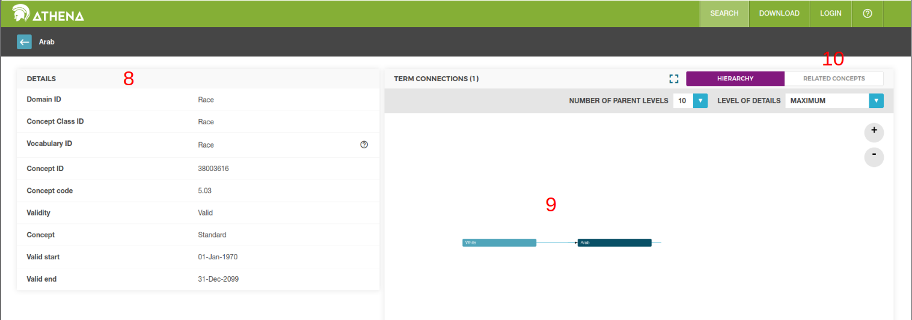

# Modelo do banco de dados para o aplicativo SAÚDE! baseado no OMOP CDM

## 1 Introdução

Neste arquivo será apresentada uma brevíssima introdução ao OMOP CDM, bem como as decisões tomadas pelo grupo de desenvolvimento do aplicativo SAÚDE! sobre as tabelas e campos utilizados no projeto. Por fim, divergências quanto a tabelas e conceitos (vocabulários) que não se encontram no modelo padrão do OMOP CDM serão explicitadas e as razões para tais modificações serão consideradas. Acreditamos que dessa forma, pesquisadores que tenham em mãos os dados armazenados ao longo do projeto possam facilmente transformar esses dados totalmente no padrão OMOP CDM desejado.

O principal objetivo do projeto OMOP CDM é desenvolver um modelo (e vocabulários) para que a comunidade que trabalhe com prontuários médicos possam utilizar como ponto comum na sua pesquisa. Dessa forma, é bastante voltado para o processo de transformação de bancos com modelos distintos para o modelo "padrão" disponibilizado pela entidade responsável pelo mesmo. No projeto SAÚDE! a ideia é utilizar o modelo mais alinhado possível ao padrão, tornando o processo de transformação bem mais simples.

### 1.1 Termos recorrentes

Alguns termos recorrentes para contextualizar o projeto que nosso modelo de banco é baseado:

Observational Medical Outcomes Partnership (OMOP) ⇒ "a public-private consortium based in the United States of America, created with the goal of improving the state of observational health data for better drug development, which started in response to the U.S. Food and Drug Administration (FDA) Amendments Act of 2007"

Common Data Model (CDM) ⇒ "OMOP developed a CDM, standardizing the way observational data is represented. After OMOP ended, this standard started being maintained and updated by OHDSI"

Observational Health Data Sciences and Informatics (OHDSI) ⇒ "is an international collaborative effort aimed at improving health outcomes through large-scale analytics of health data ..."

— [Wikipedia](https://en.wikipedia.org/wiki/Observational_Health_Data_Sciences_and_Informatics)

"EMR (Electronic Medical Record) : É um registro digital das informações médicas de um paciente criado e mantido por um único provedor de assistência médica ou clínica. Contém informações médicas como histórico médico, diagnósticos, medicações prescritas, resultados de testes laboratoriais, etc., relevantes para o tratamento do paciente dentro de uma única organização médica. O acesso ao EMR é geralmente restrito a profissionais de saúde que trabalham dentro da mesma instituição médica onde o EMR é mantido."

"EHR (Electronic Health Record): É um registro digital das informações de saúde de um paciente que é compartilhado entre múltiplos provedores e organizações de saúde. Além das informações encontradas em um EMR, um EHR pode conter informações mais amplas, como registros de saúde do paciente ao longo do tempo, resultados de exames de diferentes instituições médicas, registros de internações hospitalares, registros de tratamentos, etc.
O EHR é projetado para ser acessível por vários prestadores de cuidados de saúde em diferentes locais, proporcionando uma visão mais abrangente e integrada da saúde de um paciente."

— [EMR vs. EHR](https://anestesiagaap.com.br/emr-vs-ehr/)

"Observational databases differ in both purpose and design. EMR are aimed at supporting clinical practice at the point of care, while administrative claims data are built for the insurance reimbursement processes. Each has been collected for a different purpose, resulting in different logical organizations and physical formats, and the terminologies used to describe the medicinal products and clinical conditions vary from source to source. The CDM can accommodate both administrative claims and EHR ..."

— [Why do we need a CDM?](https://www.ohdsi.org/data-standardization/)

### 1.2 Versões utilizadas

O projeto foi desenvolvido considerando para alinhamento do banco de dados a versão 5.4 do modelo OMOP CDM. A escolha foi considerando que era a versão estável na época de início do projeto:

"As of April 2025, the most recent CDM is at version 6.0, while version 5.4 is the stable version used by most tools in the OMOP ecosystem."  
— [Wikipedia](https://en.wikipedia.org/wiki/Observational_Health_Data_Sciences_and_Informatics)

Em relação aos conceitos (ou *concepts*), uma das partes centrais do modelo, foram baixados todos os vocabulários disponíveis na plataforma ATHENA no mês de maio. Como a proposta do projeto se expande para além de um prontuário médico, conceitos novos foram adicionados para alcançar nosso objetivo. Tais conceitos, domínios, classes e vocabulários foram adicionados no arquivo app_saude/commands/seed_concepts.py. Conceitos padrão escolhidos estão no mesmo arquivo. 

### 1.3 Links importantes

A seguir serão apresentados fontes importantes de informação criadas pela comunidade que desenvolve o OMOP CDM. Tais arquivos podem ser utilizados para sanar dúvidas que o presente arquivo não consiga resolver.

- [Tabelas modelo 5.4](https://ohdsi.github.io/CommonDataModel/cdm54.html#person) - principal fonte do modelo utilizado
- [Themis](https://ohdsi.github.io/Themis/index.html) - convenções de como popular as tabelas
- [Athena](https://athena.ohdsi.org/search-terms/start) - vocabulários existentes
- [The Book of OHDSI](https://ohdsi.github.io/TheBookOfOhdsi/index.html#license) - livro do OHDSI explicando o modelo de forma didática
- [Forums OHDSI](https://forums.ohdsi.org) - fórum com discussões sobre o OHDSI
- [GitHub OHDSI](https://github.com/OHDSI)
- [Site OHDSI](https://www.ohdsi.org/data-standardization)
- [FAQ CMD](https://ohdsi.github.io/CommonDataModel/faq.html)
- [OMOP CDM ERD](https://ohdsi.github.io/CommonDataModel/cdm54erd.html) - esquema relacional da versão 5.4
- [Esquema OMOP CDM](https://omop-erd.surge.sh/omop_cdm/index.html) - esquema visual do modelo (pode ser mais lento)

### 1.4 FAQ

O [*frequently asked questions*](https://ohdsi.github.io/CommonDataModel/faq.html) disponibilizado pelo OHDSI é uma boa fonte para retirar dúvidas pontuais mas é extenso e um pouco díficil de compreender para pessoas sem conhecimento prévio na área. Entretanto, algumas perguntas foram importantes para o grupo entender melhor o modelo:

- 2. How does my data get transformed into the common data model?
- 3. Are any tables or fields optional?
- 6. How are gender, race, and ethnicity captured in the model? Are they coded using values a human reader can understand?
- 7. Are there conditions/procedures/drugs or other domains that should be masked or hidden in the CDM?
- 8. How is time-varying patient information such as location of residence addressed in the model?
- 9. How does the model denote the time period during which a Person’s information is valid?
- 11. What if I have EHR data? How would I create observation periods?
- 12. Do I have to map my source codes to Standard Concepts myself? Are there vocabulary mappings that already exist for me to leverage?
- 16. What if I have source codes that are specific to my site? How would these be mapped?

## 2 Descrição do OMOP CDM

### 2.1 Tabelas disponíveis

#### 2.1.1 Standardized clinical data

#### 2.1.2 Standardized health system

#### 2.1.1 Standardized vocabularies

#### 2.1.4 Standardized health economics

#### 2.1.5 Standardized derived elements

#### 2.1.6 Standardized metadata

## 3 Vocabulários

## 4 Modelo SAÚDE!

### 4.1 Diagrama do modelo

As tabelas estão divididas em grupos distintos:

-**app_saude** são as tabelas aderidas ao OMOP CDM e utilizadas para armazenar dados dentro do prontuário (menos RecurrenceRule)

As outras tabelas estão relacionadas aos mecanismos de funcionamento do aplicativo e não no "prontuário" aderido ao OMOP CDM.

-**auth** dados relacionados a autenticação

-**authtoken**

-**account**

-**socialaccount**

-**contenttypes**

-**admin**

-**sessions**

-**sites**

### 4.2 Explicação das tabelas e vocabulários escolhidos

## 5 Ferramentas importantes

Por se tratar de um modelo que vem sendo desenvolvido ao longo de vários anos, e com grande engajamento da comunidade, o OMOP CDM apresenta um alto número de ferramentas para auxiliar os gerenciadores de bancos de dados que queiram aderir ao padrão. Aqui serão apresentadas 3 das principais, sendo as duas primeiras utilizadas diretamente pelo grupo para o desenvolvimento do modelo SAÚDE!. 

### 5.1 ATHENA
O [Athena](https://athena.ohdsi.org/search-terms/start) é a fonte para encontrar conceitos necessários para utilizar no banco de dados. Existem duas formas distintas de fazer essa busca, procurar por conceitos específicos ou por vocabulários inteiros. No caso de vocabulários inteiros é necessário fazer um login (2) e clicar no botão do lado superior direito (1). Você será redirecionado para uma lista com todos os vocabulários disponíveis. Alguns não são públicos e só podem ser acessados com uma chave de apropriada. Após a escolha dos vocabulários, o sistema gerará uma pasta com todos os conceitos escolhidos (não só os conceitos daquele vocabulário, mas outros que tenham alguma relação com ele) e também outras entradas importantes, como entradas para as tabelas concept_ancestor, concept_class, concept_relationship, concept_synonym, domain, drug_strengh, relationship e vocabulary. Tais dados já estão com todos os campos existentes para cada conceito, dessa forma, basta importa-los diretamente para o banco. 

Por outro lado, caso a escolha seja por baixar um conjunto menor de conceitos (3), é necessário fazer uma busca por um termo especifíco (4). Nesse caso também é possível filtrar por grupos específicos, como limitar os vocabulários, domínios ou classes em que serão procurados (6). As palavras-chaves utilizadas como filtros serão apresentadas no topo superior esquerdo (5). Como pode ser visto em (7), diferentemente da busca por vocabulários inteiros, ao baixar conceitos diretamente dessa página, alguns dados (como o período de validade do termo) não são baixados conjuntamente. Dessa maneira, não é possível popular tabelas que esperem todos os campos disponíveis no modelo 5.4 diretamente. Uma questão a ser considerada é em relação ao tamanho dos arquivos baixados. Enquanto que ao baixar apenas os conceitos (3), temos um arquivo, em geral, pequeno, de poucos bytes. Por outro lado, ao baixar vocabulários inteiros (1), recebemos outros conceitos que podem não ser de interesse dependendo da complexidade do projeto. Por exemplo, ao baixarmos os arquivos com os conceitos de gênero por (3) recebemos um arquivo de tamanho de 156 bytes enquanto pela rota (1) a pasta baixada é de 79,1 MB. 

Caso seja necessário verificar mais detalhes de conceitos (principalmente sua relação hierarquica), é possível selecionar um conceito individualmente clicando sobre ele. Além de verificar todas as entradas do conceito (8), é possível verificar graficamente a relação hierarquica existente em que ele está envolvido (9) e verificar outros termos relacionados com ele (10).

### 5.2 THEMIS
O [Themis](https://ohdsi.github.io/Themis/) é uma ferramenta para centralizar questões importantes de como popular as tabelas do OMOP CDM. Foi utilizada pelo grupo para entender certas convenções (por exemplo, quais gêneros ter como opção, como adicionar grupos multiétnicos (ou não), entre outros). Geralmente temas que levantaram algum tipo de questionamento dentro da comunidade são divididos em Issues. Cada Issue tem uma descrição e uma série de seções discutindo qual o correto padrão de funcionamento. Em uma dessas é apresentada a convenção ratificada pela comunidade de como o problema deve ser tratado. Uma questão importante, mas que não foi explorada, é o uso do (DataQualityDashboard). Esse é basicamente uma ferramente utilizada para verificar o quanto o banco de dados em funcionamento está alinhado com as boas práticas definidas pela comunidade do OMOP CDM. Algumas Issues apresentam links para acessar o DQD e qual tipo de verificação é indicado para aquele problema especifico.

### 5.3 ATLAS
O [Atlas](https://atlas-demo.ohdsi.org/) é uma ferramenta para design e análise de dados dentro do padrão OMOP. Não utilizada durante o projeto do MVP do aplicativo, mas pode ser importante para próximas etapas, caso o volume de dados coletados seja relevante. 